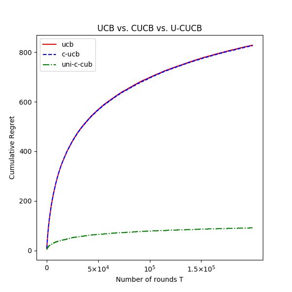

# A New Approach to Correlated Multi Armed Bandits

Authors' implementation of the paper - "A New Approach to Correlated Multi Armed Bandits"

[Link to paper](https://ieeexplore.ieee.org/document/9027344)

The paper above introduces the UCUCB (Also called U-CUCB, Uni-CUCB or Uniform CUCB) algorithm which is a distribution learning approach to minimizing regret for the Correlated Multi-Armed Bandit problem. The code also implements the CUCB (Also called UCB-C or Correlated UCB) algorithm first described in an early version of reference [2].

For background on the Correlated Multi-Armed bandit framework see references [1], [2] 

These scripts simulate the vanilla UCB, CUCB and UCUCB policies on a specified correlated bandit instance and produce an expected cumulative regret vs. horizon T plot with separate trend lines corresponding to each of the policies. The code is designed to work for a general discrete random variable X as opposed to a parameterized continuos random variable.   

  
   
<b>A regret plot example for an instance where UCUCB outperformed CUCB</b>

### Usage

1. Create a bandit instance `.txt` file defining the correlated bandit instance on which the policies are to be simulated 

2. Set the simulation parameters in the script

3. Run script and save results in a `.txt` file

Details Coming soon

### Related Work on Github

1. Our implementation of other sequential decision making algorithms for Multi-Armed-Bandits implemented in [this repository](https://github.com/ishank-juneja/intelligent-agents). Implemented algorithms 

2. Work on correlated Age-of-Information bandits [repository](https://github.com/ishank-juneja/Correlated-AoI-Bandits)  

### References

[1] I. Juneja, D. S. Gaharwar, D. Varshney and S. Moharir, "A New Approach to Correlated Multi Armed Bandits," 2020 International Conference on COMmunication Systems & NETworkS (COMSNETS), Bengaluru, India, 2020, pp. 634-637, doi: 10.1109/COMSNETS48256.2020.9027344.

[2] S. Gupta, G. Joshi and O. Yağan, "Correlated Multi-Armed Bandits with A Latent Random Source," ICASSP 2020 - 2020 IEEE International Conference on Acoustics, Speech and Signal Processing (ICASSP), Barcelona, Spain, 2020, pp. 3572-3576, doi: 10.1109/ICASSP40776.2020.9054429.